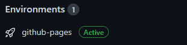

<h1>Projeto Jogo de Escolhas</h1>

Este foi o projeto final de módulo 1, do bootcamp Resilia Educação - Web Dev Full Stack. Neste projeto foram utilizadas as linguagens HTML, CSS e JS. O mecanismo principal de funcionamento são as escolhas feitas pelo usuário, e estas, devem levar o jogador com o personagem escolhido através de toda a narrativa. A narrativa desenvolvida é uma nova forma de contar a história de 3 personagens que envolvem e fazem parte de todos os filmes do Shrek. Shrek: a new story, baseada em Shrek - O Capítulo Final, conta três histórias diferentes, embora um pouco interligadas, que compõem 3 fases para os personagens Rei Harold, Shrek e Fiona. Todos eles sob efeito da magia de uma criatura mágica má e antagonista, o anão Rumpelstiltskin.

 

 

> Status do projeto: Sujeito a melhorias.
<h2>Requisitos</h2>

<ul>
  <li>Deve ser possível jogar com ao menos 3 personagens diferentes.</li>
  <li>3 etapas/fases devem ser implementadas para cada personagem.</li>
  <li>A entrada do usuário deve ser realizada pelo prompt.</li>
  <li>As opções escolhidas no prompt devem guiar o jogador dentro na narrativa.</li>
  <li>Cada etapa/fase deve ser implementada em um arquivo diferente.</li>
</ul>
<h2>Documentações e Referências</h2>

<ul>
  <li><a href="https://developer.mozilla.org/pt-BR/docs/Web/CSS/Pseudo-classes">Pseudo-classes</a></li>
  <li><a href="https://developer.mozilla.org/pt-BR/docs/Learn/JavaScript/Building_blocks/Events">Eventos</a></li>
  <li><a href= "https://www.w3schools.com/jsref/event_onclick.asp">Onclick</a></li>
  <li><a href="https://developer.mozilla.org/pt-BR/docs/Web/API/Window/location">Window.location</a></li>
</ul>

<h2>GitHubs Pages é logo ali...</h2>

 

<strong>Desenvolvido por <a target= "_blank" href="https://www.linkedin.com/in/cibele-martins-85b910169/">Cibele Martins</a>.</strong>

